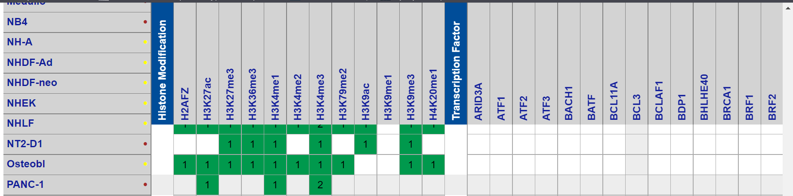
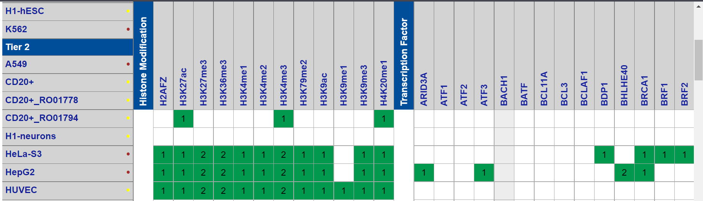
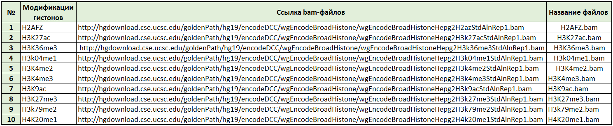

# hse_hw3_chromhmm

В рамках предыдузего ДЗ2 Были использованы данные PANC-1, для ДЗ3 не было достаточных данных.

Были выбраны данные HepG2.

### Скачивание файлов 

### Анализ меток с помощью ChromHMM:
Ссылка на Google Colab: https://colab.research.google.com/drive/16L_5GFkjNJGnarDiQLc0ayrdVGbRCsTp?usp=sharing

Для анализа был создан файл cellmarkfiletable.txt
